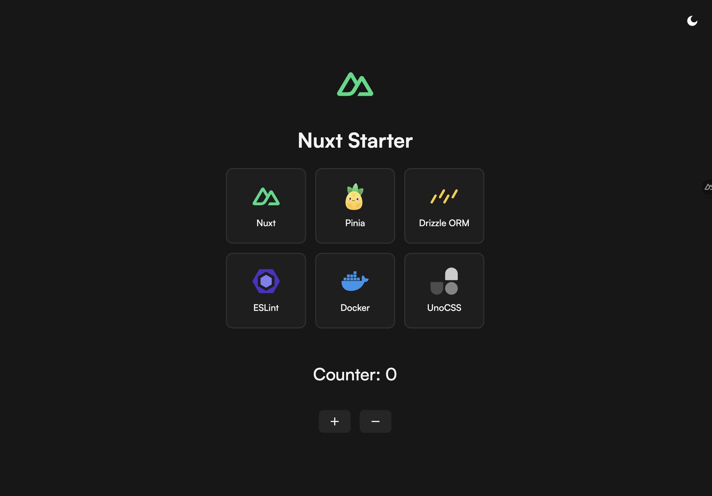

# Nuxt 3 Starter Template

A modern Nuxt 3 starter template with Drizzle ORM, ESLint, Pinia, Docker, and UnoCSS. This template provides a robust foundation for building full-stack applications with best practices and powerful tools.

## 🚀 Stack

- **[Nuxt 3](https://nuxt.com/)** - The Intuitive Vue Framework
- **[UnoCSS](https://unocss.dev/)** - Instant On-demand Atomic CSS Engine
- **[Drizzle ORM](https://orm.drizzle.team/)** - TypeScript ORM with powerful migrations
- **[ESlint](https://eslint.org/)** - The pluggable linting utility
- **[Pinia](https://pinia.vuejs.org/)** - Intuitive state management
- **[Docker](https://www.docker.com/)** - Containerization support

## 📄 License

[MIT License](./LICENSE)
